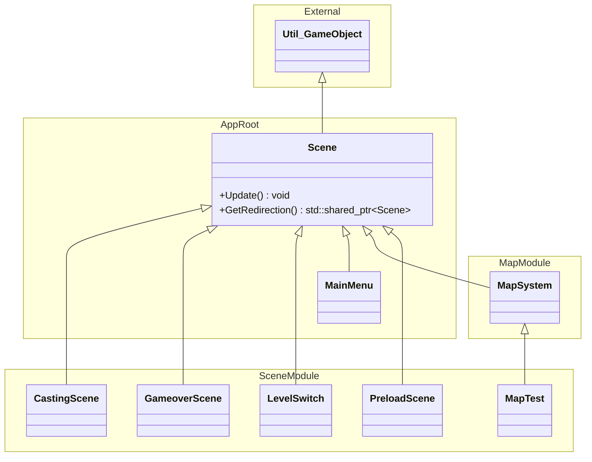
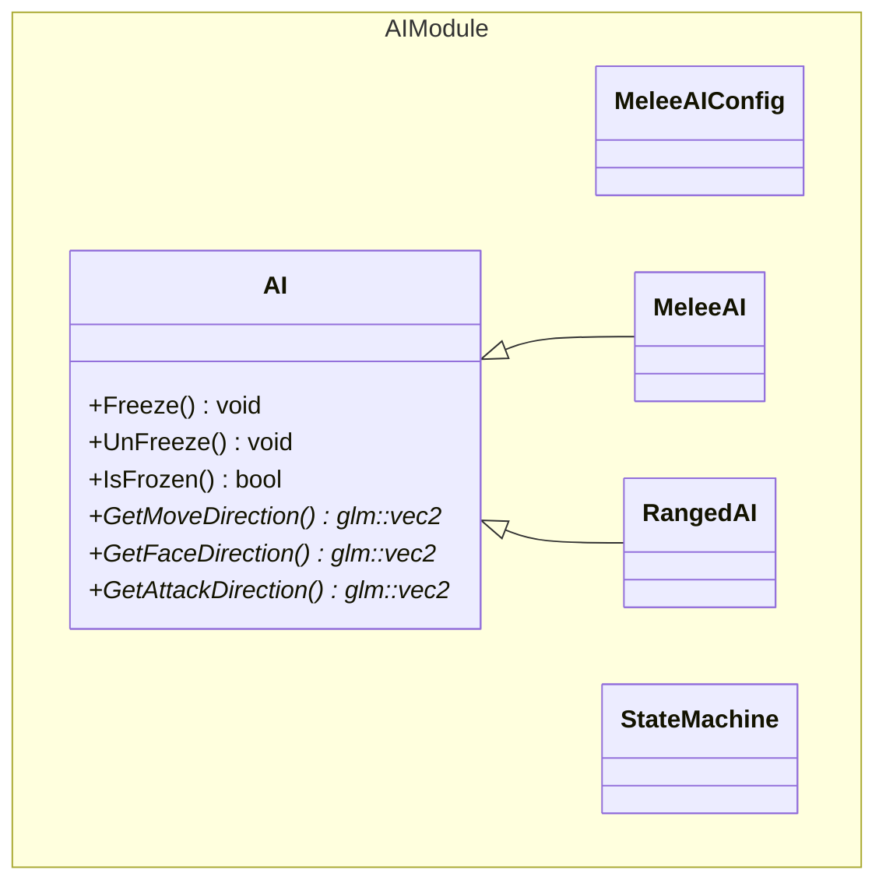
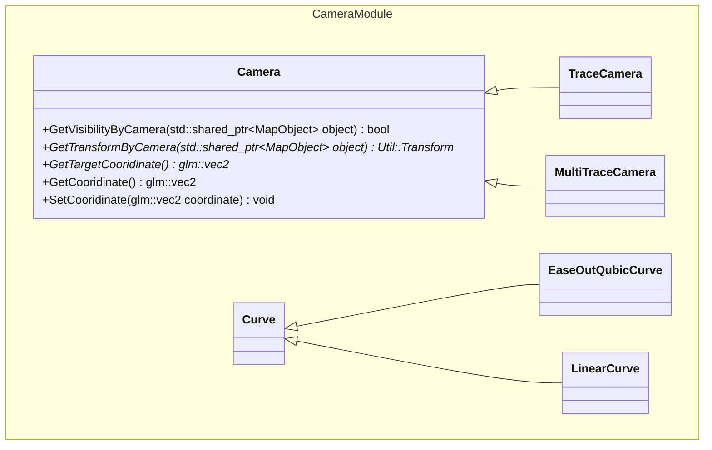
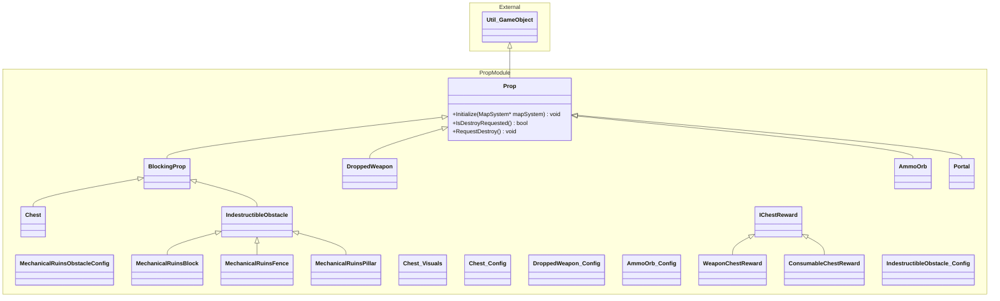
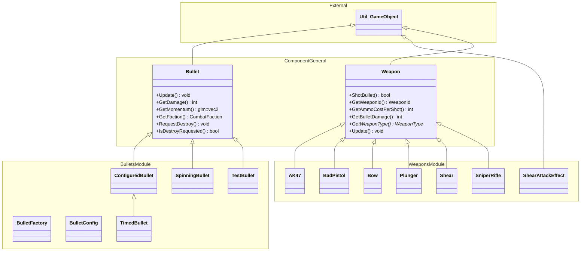
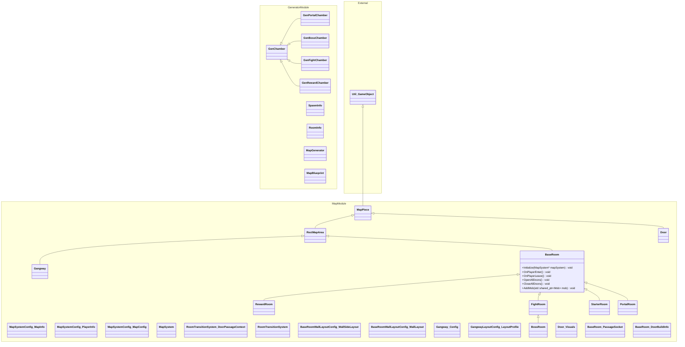

# 2026 OOPL Final Report

## 組別資訊

組別：第 17 組  
組員：邱冠勛  
復刻遊戲：元氣騎士

## 專案簡介
本專案以復刻涼屋遊戲的元氣騎士為目標，並結合 C++ 的物件導向理念與 PTSD 遊戲框架進行開發。
意旨使用上學期習得的程式設計技巧，如：繼承、多型、虛擬函式等概念，解決在實作遊戲過程只中遇到的困難。
由於時間與技術上的限制，本專案並非追求百分百的細節還原，而是關注在遊戲中的核心部分與程式的正確性，如：地圖生成、碰撞、指標處理等方面；
反之在其他部分如：美術、動畫、特效、音效等方面的琢磨會較為粗糙。

### 遊戲簡介
《元氣騎士》是一款由涼屋遊戲開發的像素射擊彈幕遊戲，主角會在地下城中通過與怪物戰鬥獲得 MP 值以發射武器的子彈，
同時也需維持自身的血量，以保證能夠撐到最終的 Boss 關卡，在連續討伐 3 隻 Boss 後即判定獲勝。

### 組別分工

#### 邱冠勛
1. 隨機地圖與怪物生成系統製作
2. 遠程 AI 走位系統製作
3. 遊戲的開始畫面、可互動的 UI 元素包括按鈕與滑桿
4. 音效與背景音樂系統製作
5. 場景與關卡切換系統製作
6. 結尾結算動畫與製作人員名單製作
7. 相機系統製作

#### 朱政全
1. 

## 遊戲介紹

### 遊戲規則

### 遊戲畫面

## 程式設計
### 程式架構
#### 場景概念 (Scene)
遊戲中所有的畫面都是由 Scene 支撐，從初始介面到遊玩場景甚至是最後的鳴謝清單。且 GameLoop 會不斷詢問目前的 Scene 是否有切換場景的需求，以此實現場景切換的功能。

#### 遊戲角色
遊玩畫面中的角色無論是否能被玩家操控，都繼承自 ``Character`` 類別，且經由 ``GetMoveIntent()`` 與 ``GetFaceDirection()`` 等虛擬函式來讓子類別回傳移動方向。

#### UI 介面
所有可互動的按鈕或置頂顯示的元素都基於 UI 介面之上，並且可以再 ``Scene`` 類別中心增成員變數來將 UI 介面顯示在 Scene 之上，且基礎類別中的 ``GetExitSignal()`` 可以即時返回此 UI 是否要關閉，以方便刪除開啟的介面。

#### 怪物AI
遊戲中的 AI 有一個父類別，並且具備兩個子類別，分別是套用於進戰武器的``MeleeAI`` 與遠程武器的 ``RangedAI``，他們分別時做了不同的移動與攻擊邏輯。

#### 相機
在場景中如果有定位角色的需求可以使用相機，相機的父類別是一個抽象的類別，且子類別的相機會去實作各自的運鏡邏輯與移動速曲線，以 ``TraceCamera`` 與 ``EaseOutQubicCurve`` 配合來說，他會以 ``EaseOutQubic`` 這調速度曲線去追隨 Target 的位置。

#### 碰撞系統

#### 武器與子彈系統

#### 地圖生成系統

### 程式技術

### 使用到 AI/AI Agent 的部分 (沒有用到者，不需要寫這篇)

## 結語

### 問題與解決方法
### 自評

| 項次 | 項目                   | 完成 |
|------|------------------------|-------|
| 1    | 這是範例 |  V  |
| 2    | 完成專案權限改為 public |    |
| 3    | 具有 debug mode 的功能  |    |
| 4    | 解決專案上所有 Memory Leak 的問題  |    |
| 5    | 報告中沒有任何錯字，以及沒有任何一項遺漏  |    |
| 6    | 報告至少保持基本的美感，人類可讀  |    |

### 心得
### 貢獻比例
