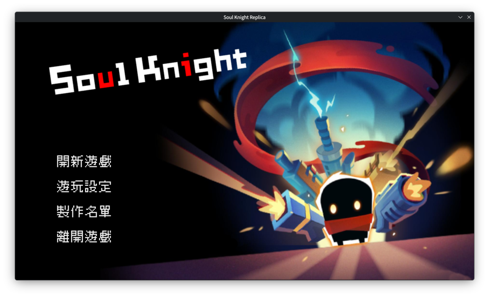
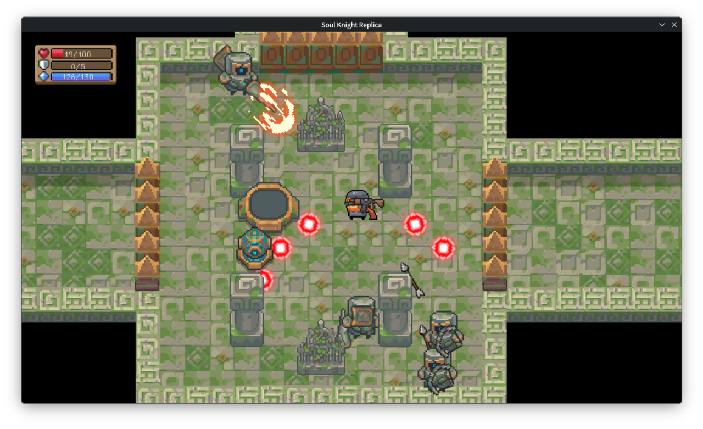
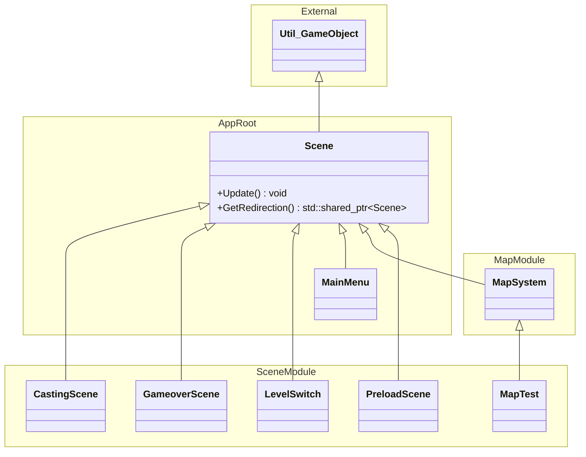
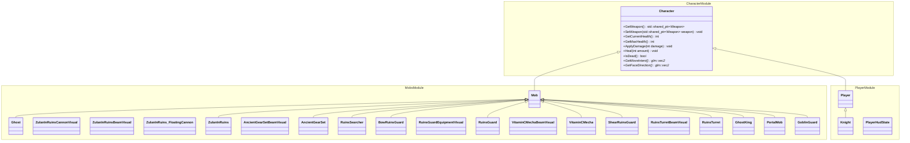
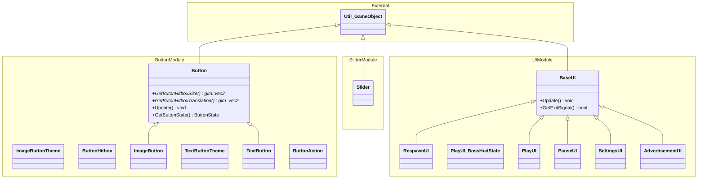
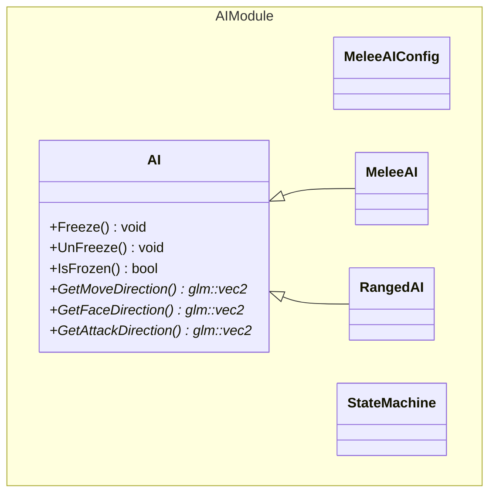
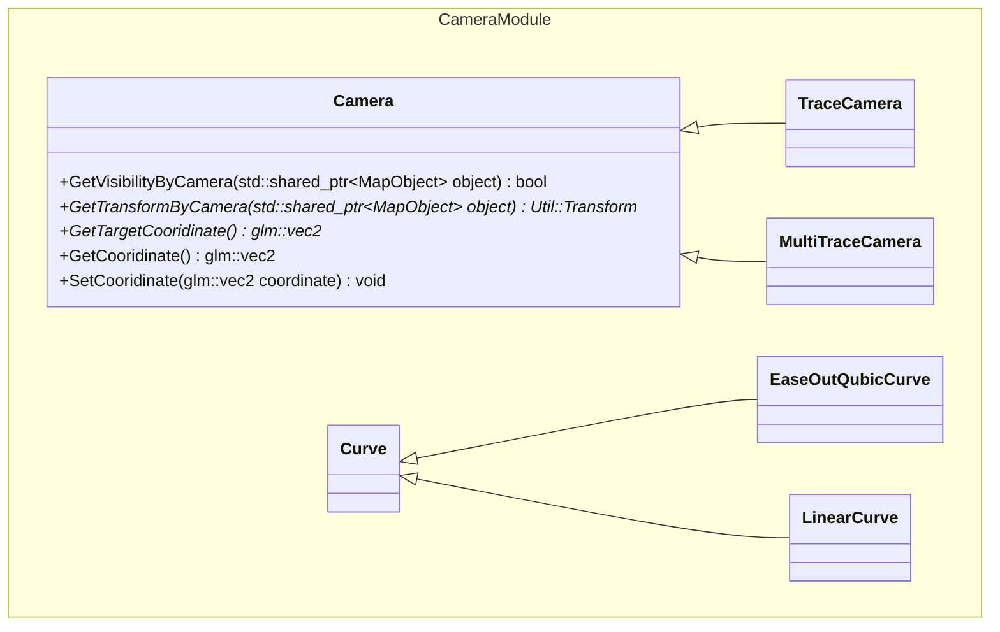
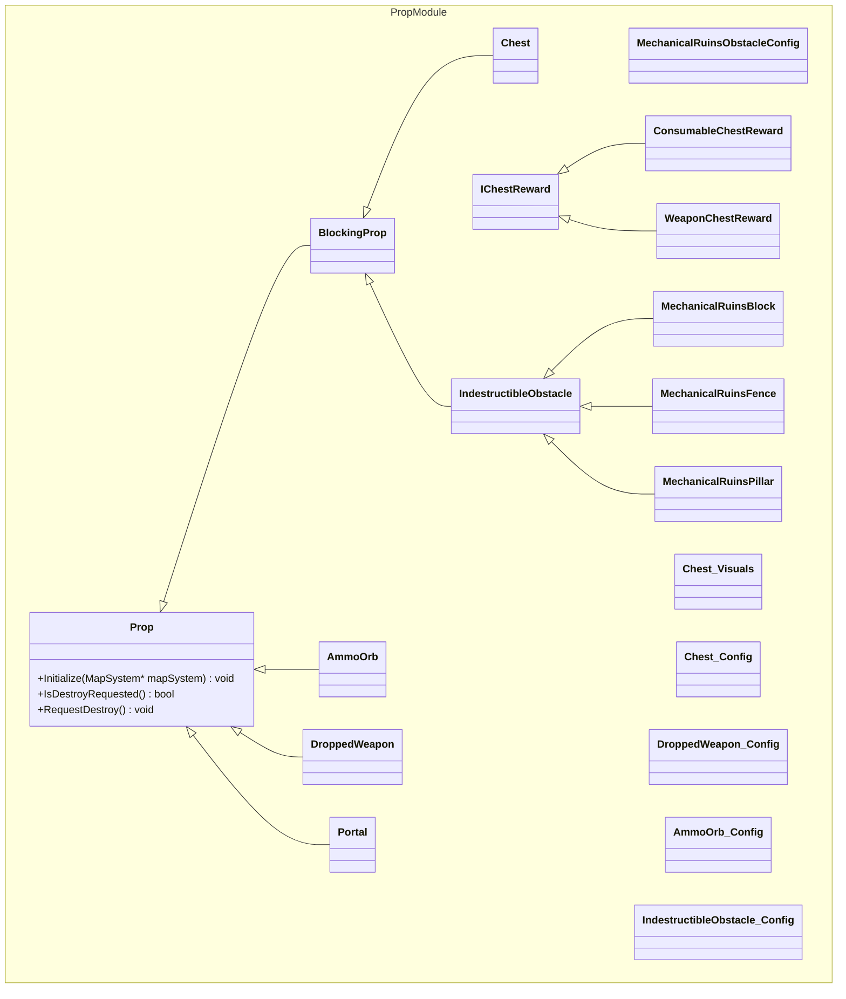
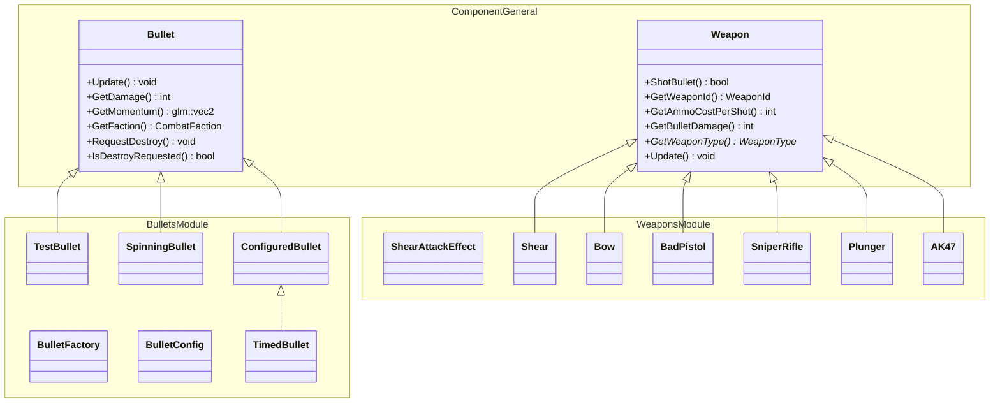
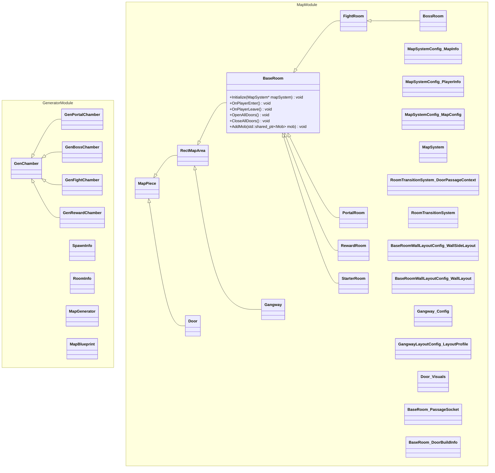

# 2026 OOPL Final Report

## 組別資訊
組別：第 17 組  
組員：邱冠勛  
復刻遊戲：元氣騎士

## 專案簡介
本專案以復刻涼屋遊戲的元氣騎士為目標，並結合 C++ 的物件導向理念與 PTSD 遊戲框架進行開發。
意旨使用上學期習得的程式設計技巧，如：繼承、多型、虛擬函式等概念，解決在實作遊戲過程只中遇到的困難。
由於時間與技術上的限制，本專案並非追求百分百的細節還原，而是關注在遊戲中的核心部分與程式的正確性，如：地圖生成、碰撞、指標處理等方面；
反之在其他部分如：美術、動畫、特效、音效等方面的琢磨會較為粗糙。

### 遊戲簡介
《元氣騎士》是一款由涼屋遊戲開發的像素射擊彈幕遊戲，主角會在地下城中通過與怪物戰鬥獲得 MP 值以發射武器的子彈，
同時也需維持自身的血量，以保證能夠撐到最終的 Boss 關卡，在連續討伐 3 隻 Boss 後即判定獲勝。

### 組別分工
#### 邱冠勛
1. 隨機地圖與怪物生成系統製作
2. 遠程 AI 走位系統製作
3. 遊戲的開始畫面、可互動的 UI 元素包括按鈕與滑桿
4. 音效與背景音樂系統製作
5. 場景與關卡切換系統製作
6. 結尾結算動畫與製作人員名單製作
7. 相機系統製作

#### 朱政全
1. 碰撞箱製作
2. 小怪製作製作
3. Boss 製作
4. 武器製作

## 遊戲介紹
玩家需要操控角色 Knight 一路過關斬將，雖然無法相關羽那樣過五關斬六將，但至少也有過九關展三將。
遊戲關卡分成三個章，每張共有三小節，且在每個章的最後一個小節設有章節 Boss。
玩家會需要穿越一個又一個隨機生成的房間，並清空房間內的有小怪，最後抵達到藍色傳送門房間進入下一關。
如果在遊戲中途死亡，可以選擇觀看 37 秒的廣告復活，助各位有個美好的遊戲夜晚。

### 遊戲規則
玩家必須在保持生命值的同時，利用手上與寶箱中獲取的武器來推進關卡，並一路突破隨機生成的房間與小怪和Boss戰鬥，最後抵達 3-3 贏得遊戲勝利！
#### 操作
| Key | Function |
| --- | --- |
| `W` | 向上移動 |
| `A` | 向左移動 |
| `S` | 向下移動 |
| `D` | 向右移動 |
| `Space` | 射擊 |
| `Q` | 換武器|
| `E` | 撿起武器|
| `LMB` | 點按鈕 |
| `Esc` | 暫停遊戲 |

#### 除錯模式
| Key | Function |
| :-- | :------- |
| ``R`` | 開啟碰撞箱顯示 |
| ``T`` | 鎖血 + 武器不消耗能量 |
| ``P`` | 清除當前房間的怪物 (包含 Boss) | 

#### 數值介紹
遊玩介面有三個數值要注意，他們皆顯示在螢幕的左上角。
1. 生命值 ()：玩家目前的血量，如果歸零會導致廣告的推送。血量不會隨時間回復，唯一的回血方式是觀賞 37 秒的影片。
2. 護盾值 ()：當護盾直不為 0 時，會吸收所有玩家受到的傷害並扣除 1 點，如果沒有護盾值則會直接扣血。護盾值在沒有受到傷害時會逐漸回復。
3. 能量值 ()：能量值可以用來發射武器的子彈，當能量值規零時則無法使用會消耗能量值的武器。如果您遇到此情況，請直接跑到怪物旁邊，這會切換到不會消耗能量的近戰手刀。

### 遊戲畫面

## 程式設計
### 程式架構
#### 場景概念 (Scene)
遊戲中所有的畫面都是由 Scene 支撐，從初始介面到遊玩場景甚至是最後的鳴謝清單。且 GameLoop 會不斷詢問目前的 Scene 是否有切換場景的需求，以此實現場景切換的功能。

#### 遊戲角色
遊玩畫面中的角色無論是否能被玩家操控，都繼承自 ``Character`` 類別，且經由 ``GetMoveIntent()`` 與 ``GetFaceDirection()`` 等虛擬函式來讓子類別回傳移動方向。

#### UI 介面
所有可互動的按鈕或置頂顯示的元素都基於 UI 介面之上，並且可以再 ``Scene`` 類別中心增成員變數來將 UI 介面顯示在 Scene 之上，且基礎類別中的 ``GetExitSignal()`` 可以即時返回此 UI 是否要關閉，以方便刪除開啟的介面。

#### 怪物AI
遊戲中的 AI 有一個父類別，並且具備兩個子類別，分別是套用於進戰武器的``MeleeAI`` 與遠程武器的 ``RangedAI``，他們分別時做了不同的移動與攻擊邏輯。

#### 相機
在場景中如果有定位角色的需求可以使用相機，相機的父類別是一個抽象的類別，且子類別的相機會去實作各自的運鏡邏輯與移動速曲線，以 ``TraceCamera`` 與 ``EaseOutQubicCurve`` 配合來說，他會以 ``EaseOutQubic`` 這調速度曲線去追隨 Target 的位置。

#### 碰撞系統

#### 武器與子彈系統

#### 地圖生成系統

### 程式技術
本專案以 C++ 實作，並使用 PTSD 框架提供的 `Util::GameObject`、`Util::Renderer`、`Util::Animation`、`Util::Image`、`Util::Input`、`Util::SFX` 與 `Util::BGM` 作為遊戲基礎。整體架構採用「場景 Scene + 遊戲物件樹」的方式組織：`App` 持有目前的 `Scene`，並把它掛到 `Util::Renderer` 的 root 底下；每一幀會先檢查目前 Scene 是否透過 `GetRedirection()` 要求切換，再呼叫 `Update()` 更新遊戲狀態與畫面。因此主選單、預載畫面、關卡選擇、遊玩場景、Game Over 畫面都能用同一套生命週期管理。

遊玩中的主要邏輯集中在 `MapSystem`。`MapSystem` 繼承自 `Scene`，負責管理房間、走廊、玩家、怪物、子彈、道具、鏡頭、碰撞與場景跳轉。為了避免在更新迴圈中直接修改容器造成 iterator 失效，系統另外設計了 pending queue，例如 `m_PendingBullets`、`m_PendingMobs`、`m_PendingProps`，在合適的時間點再統一加入場景；子彈與道具會透過 `RequestDestroy()` 標記後集中移除，怪物死亡則由死亡事件觸發掉落物生成與後續狀態處理。

地圖採用程序生成。`MapGenerator` 先在 `MapBlueprint` 的格狀資料中放入起始房、戰鬥房、獎勵房、傳送門房與 Boss 房，再由 `BuildRuntimeMap()` 將藍圖轉成實際的 `BaseRoom`、`FightRoom`、`RewardRoom`、`PortalRoom`、`BossRoom` 與 `Gangway` 物件。不同難度會決定戰鬥房數量與 Boss 類型；生成過程若遇到不合法的房間配置會重新嘗試，並支援 seed 以便重現同一張地圖。

碰撞系統以 AABB 為核心。所有需要參與碰撞的角色、子彈或阻擋物件實作 `ICollidable`，由 `CollisionSystem` 將它們轉成 `CollisionPrimitive`。移動前會透過 `ResolveMovement()` 或 `PredictMovement()` 檢查牆壁、房間邊界、道具與動態物件，並依 `CollisionFilter` 判斷哪些物件需要互動。這讓玩家移動、怪物追蹤、子彈飛行、近戰攻擊與地圖阻擋都能共用同一套碰撞查詢邏輯。

角色系統以 `Character` 作為共同父類別，整合血量、武器、動畫、受擊、死亡、碰撞盒與面向更新。玩家端由 `Player` 與 `Knight` 擴充，加入護盾、魔力、兩格武器欄、武器切換、近戰攻擊與 HUD 狀態輸出；怪物端由 `Mob` 擴充出多種敵人與 Boss。`Character` 透過 `GetMoveIntent()` 與 `GetFaceDirection()` 讓子類別自行決定移動與面向，因此玩家輸入與 AI 控制可以共用角色更新流程。

怪物 AI 採用狀態機設計。`AI` 內部持有 `StateMachine`，狀態包含 `WANDER`、`PURSUIT`、`STOPANDATTACK` 與 `FRIGHTENED` 等行為。`MeleeAI` 會依照追擊距離、攻擊距離與更新間隔決定是否接近玩家；`RangedAI` 則偏向保持距離並輸出攻擊方向。AI 在移動時會使用碰撞系統做障礙物判斷，並用目標方向與隨機角度修正讓怪物行為不會完全機械化。

武器與子彈系統採用可擴充的類別階層。`Weapon` 管理射擊冷卻、彈藥消耗、傷害、暴擊率、持槍位置、槍口位置、後座力與射擊音效，並透過 callback 把產生的 `Bullet` 交給 `MapSystem`。不同武器如 `AK47`、`BadPistol`、`SniperRifle`、`Bow`、`Plunger`、`Shear` 只需覆寫或設定自己的射擊行為。子彈則透過 `BulletFactory` 與 `BulletConfig` 建立，`BulletConfig` 統一描述子彈貼圖、動畫與碰撞大小，`BulletFactory` 則負責依照座標、速度、傷害、陣營與是否限時等參數建立對應子彈。

UI 介面也被視為遊戲物件。`BaseUI` 繼承 `Util::GameObject` 與 `IStateful`，提供背景遮罩、更新流程與 `GetExitSignal()`，上層再實作 `PauseUI`、`SettingsUI`、`RespawnUI`、`PlayUI` 與 `AdvertisementUI`。按鈕系統分成 `Button`、`ImageButton`、`TextButton`，滑桿則由 `Slider` 處理，因此暫停選單、設定音量、復活選單與遊玩 HUD 都能用一致的互動方式管理。

鏡頭系統將世界座標轉成畫面座標。`Camera` 提供可見性判斷與 transform 轉換，`TraceCamera` 用來追蹤單一目標，`MultiTraceCamera` 則可考慮多個目標；移動曲線由 `Curve`、`LinearCurve`、`EaseOutQubicCurve` 控制。`MapSystem` 會遞迴套用鏡頭 transform，讓房間、角色、子彈、道具與 UI 能分別以正確的位置與層級顯示。

整體來說，專案把「遊戲狀態管理」、「場景顯示」、「地圖生成」、「碰撞查詢」、「角色 AI」、「武器子彈」與「UI」拆成獨立模組，再由 `MapSystem` 在遊玩場景中整合。這種分工讓新增怪物、武器、房間或 UI 時，不需要大幅修改主迴圈，而是擴充對應的類別並接入既有系統。

### 使用到 AI/AI Agent 的部分 (沒有用到者，不需要寫這篇)
在架構構思階段，我們將 AI Agent 作為輔助討論工具，用來提供系統拆分、類別責任分配與模組關係設計的思考方向，目標是讓整體架構更清楚、可維護，也方便後續擴充。在程式開發階段，AI Agent 則用來協助撰寫程式邏輯、提供實作範例，並協助檢查可能的設計問題，例如更新迴圈中是否邊迭代邊修改容器、物件銷毀後是否可能產生 dangling pointer、碰撞判定是否有重複邏輯、類別責任是否過度集中等。

## 結語

### 問題與解決方法

| 項次 | 遇到的問題 | 解決方法 |
|------|------------|----------|
| 1 | 場景切換時，如果每個畫面都各自處理流程，主程式會變得混亂，也不容易維護。 | 建立共同的 `Scene` 父類別，讓 `MainMenu`、`PreloadScene`、`MapSystem`、`GameoverScene` 等畫面都透過 `Update()` 與 `GetRedirection()` 管理生命週期，由 `App` 統一負責切換目前場景。 |
| 2 | 遊戲更新中會不斷產生子彈、怪物與道具，如果在迭代容器時直接新增或刪除物件，容易造成錯誤或漏更新。 | 在 `MapSystem` 中使用 `m_PendingBullets`、`m_PendingMobs`、`m_PendingProps` 暫存新物件，等到安全的時間點再統一加入；需要刪除的物件則用 `RequestDestroy()` 或死亡狀態集中清理。 |
| 3 | 玩家、怪物、子彈、牆壁與道具都需要碰撞判定，如果各自實作會產生大量重複程式。 | 設計 `ICollidable` 與 `CollisionSystem`，把可碰撞物件轉成 `CollisionPrimitive`，並用 `ResolveMovement()`、`PredictMovement()` 與 `CollisionFilter` 統一處理移動阻擋與互動判定。 |
| 4 | 隨機地圖可能產生不合理配置，例如房間無法連通、傳送門位置不適合，或 Boss 房與其他房間關係錯誤。 | 使用 `MapBlueprint` 先建立地圖藍圖，再由 `GenFightChamber`、`GenRewardChamber`、`GenPortalChamber`、`GenBossChamber` 分別產生不同房間；若配置不合法，`MapGenerator` 會重新嘗試生成。 |
| 5 | 地圖藍圖轉成實際房間時，房間大小不同會造成走廊與門口位置對不齊。 | 在 `BuildRuntimeMap()` 中根據房間格座標計算世界座標，並在建立 `Gangway` 時依照兩個房間的 passage socket、方向與尺寸差修正位置，減少房間與走廊接縫錯位。 |
| 6 | 玩家與怪物都有血量、動畫、武器、碰撞與死亡邏輯，如果分開寫會讓維護成本很高。 | 將共同邏輯放在 `Character`，玩家由 `Player`、`Knight` 擴充，怪物由 `Mob` 與各種敵人類別擴充；不同角色只需實作自己的移動意圖、面向與特殊行為。 |
| 7 | 怪物 AI 若只直接朝玩家走，容易卡在障礙物或行為過於單調。 | AI 使用 `StateMachine` 管理 `WANDER`、`PURSUIT`、`STOPANDATTACK` 等狀態，並透過碰撞系統判斷障礙物；`MeleeAI` 與 `RangedAI` 分別處理近戰與遠程怪物的移動、面向與攻擊方向。 |
| 8 | 不同武器的射速、傷害、彈藥消耗、子彈外觀與音效都不同，若全部寫在玩家類別中會過於龐大。 | 建立 `Weapon` 父類別與 `AK47`、`SniperRifle`、`Bow`、`Plunger`、`Shear` 等子類別，並用 `BulletFactory` 與 `BulletConfig` 統一建立子彈，讓武器與玩家控制邏輯分離。 |
| 9 | 畫面中的物件使用世界座標，但玩家看到的是跟隨角色移動的畫面，若每個物件自行換算座標會很難管理。 | 使用 `Camera` 系統處理世界座標到畫面座標的轉換，並透過 `TraceCamera`、`MultiTraceCamera` 與移動曲線控制鏡頭追蹤，再由 `MapSystem` 遞迴套用 transform。 |
| 10 | 暫停選單、設定介面、復活介面與遊戲 HUD 都需要互動，如果每個 UI 都獨立處理按鈕與關閉邏輯會造成重複。 | 建立 `BaseUI`、`Button`、`ImageButton`、`TextButton` 與 `Slider` 等共用元件，讓各種 UI 都能用一致的更新流程、退出訊號與互動元件完成。 |
### 自評
| 項次 | 項目                   | 完成 |
|------|------------------------|-------|
| 1    | 這是範例                                 | v   |
| 2    | 完成專案權限改為 public                  | v   |
| 3    | 具有 debug mode 的功能                   | v   |
| 4    | 解決專案上所有 Memory Leak 的問題        | v   |
| 5    | 報告中沒有任何錯字，以及沒有任何一項遺漏 | v   |
| 6    | 報告至少保持基本的美感，人類可讀         | v   |

### 心得
#### 邱冠勛
這次的 OOPL 專案可說是我人生中第一次長時間且有目標的與其他成員共同開發一個程式，

#### 朱政全
這次專案讓我們實際體會到，把一個遊戲做出來並不只是把角色畫在畫面上而已，而是要把許多系統穩定地串在一起。從場景切換、地圖生成、玩家操作、怪物 AI、碰撞判定、武器子彈到 UI 顯示，每個部分單獨看都不算太小，真正困難的是讓它們在同一個更新流程中互相配合。開發過程中，我們也發現架構設計會直接影響後續擴充的難度；例如把角色共同行為放在 `Character`，把場景邏輯集中到 `MapSystem`，讓新增怪物、武器或房間時比較不需要重寫原本的程式。另一方面，碰撞、子彈清理與物件生命週期也讓我們學到，遊戲程式必須很注意更新順序，否則容易產生難追蹤的錯誤。雖然專案中仍有可以優化的地方，但完成後能看到角色、敵人、地圖與介面真的整合成可遊玩的作品，讓我們對物件導向設計與大型程式分工有更具體的理解。

### 貢獻比例
| 姓名 | 貢獻比例 |
|------|----------|
|      | 50%      |
|   朱政全   | 50%      |